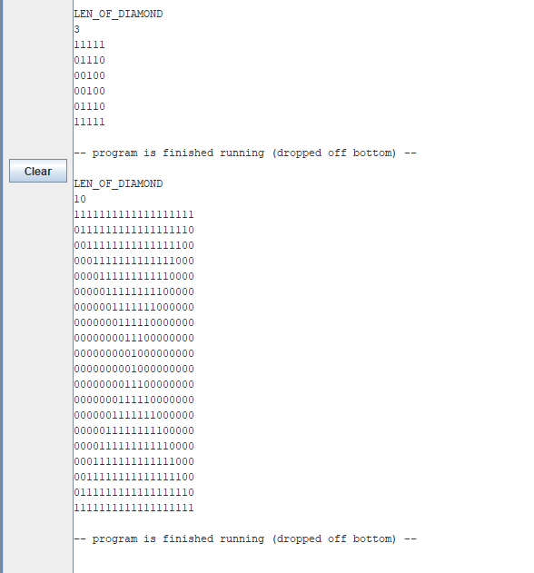

# Pascal MINI compiler

A Basic Pascal language Compiler made as a course project of *Compilers Course CS327* (IITGN). Taking the input a ".pas" file creates executables MIPS assembly code - "asmb.asm". Can be run with *MARS MIPS Simulator*.

## Command to Compile the compiler 😂


```bash
clear
rm lex.yy.c calc.tab.c calc.tab.h a.out
bison --debug -d calc.y
flex --debug tok.l
gcc calc.tab.c lex.yy.c -lfl
```

## Using Pascal MINI compiler to compile a Pascal program

```bash
./a.out<TestCodes/filename.pas
```

## Statements from PASCAL which can be compiled

- datatypes supported - ```integer```
- Arithmatic Operators ```+ - * div```
- Conditional Operators ```'<'    '>'   '<>'(not equal to)   '='(equal to)   '<='   '>='``` 
- ```while (condition) do```
- ```if .. then ..```
- ```if .. then .. else ..```
- block statement (```begin... end;```)
- ```for i:= Exp to Exp do ..```
- ```for i:= Exp downto Exp do ..```
- print with single argument -- ```write(Exp);```
- print string -- ```write('YOUR_STRING_HERE_WITH_NO_SPACE_IN_BLOCK_LETTERS');```
- read single argument -- ```read(input, VAR_NAME_HERE );```

## Some programs the compiler can compile

- Pic1


- Pic2


- Pic3


## Refrences used ..

1. https://www.cs.helsinki.fi/u/vihavain/k10/okk/minipascal/minipascalsyntax.html
2. Example Compiler (Last Lab - whileLoop) 

## Team Members

- Shah Ujjaval Satishkumar - 17110141
- Anshuman Yadav - 17110020
- Ayush Agarwal - 17110030
- Shaurya Agarawal - 17110145
